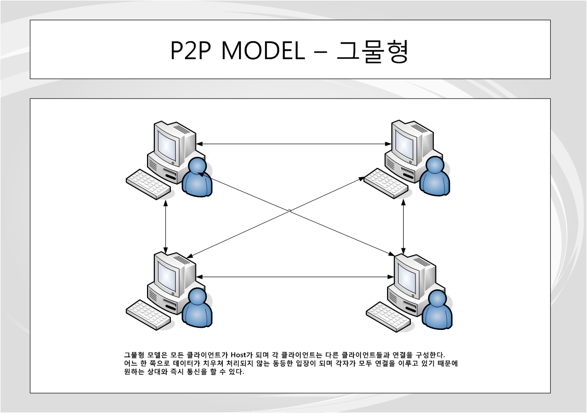
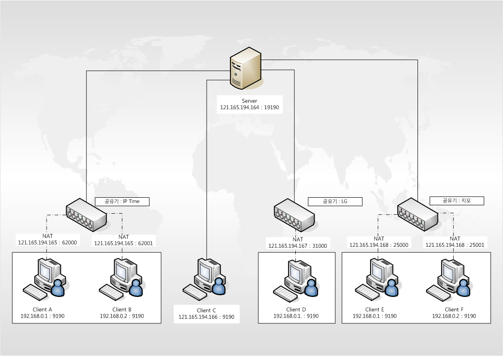
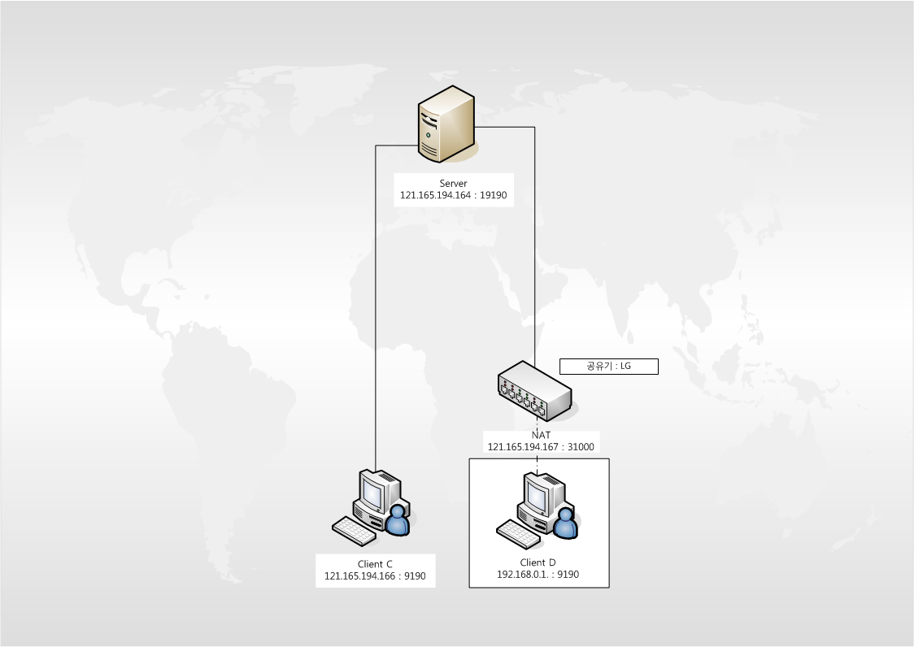
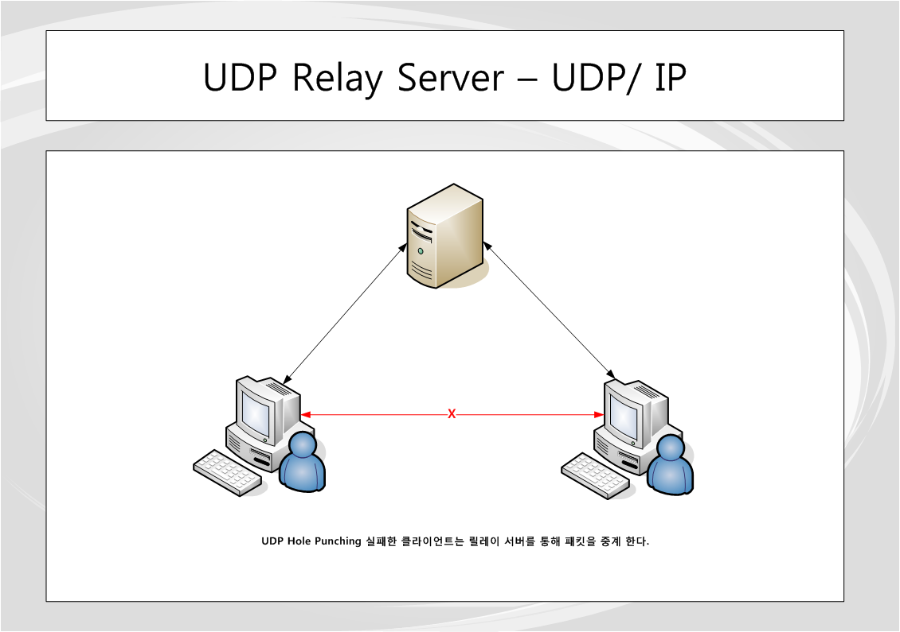
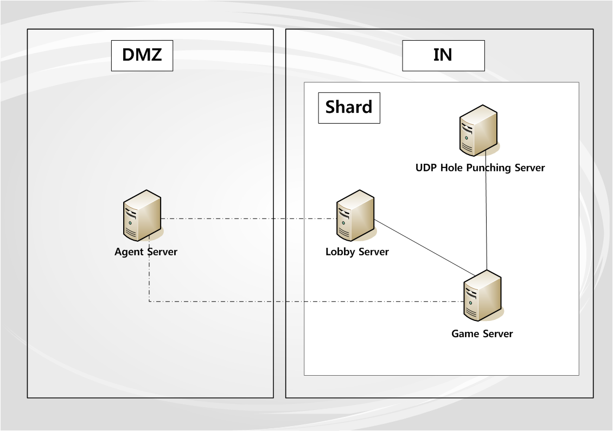

# P2PModel

**P2PModel**은 NAT 환경 하에서도 실시간 통신이 가능한 **UDP Hole Punching 기반의 하이브리드 P2P 네트워크 아키텍처**를 구현하며,  
MMO 게임 서버에 적용 가능한 **Shard 기반 확장 구조**를 함께 설계한 실전 지향 프로젝트입니다.

---

## 📐 Architecture Overview

### 🔷 P2P 모델 구조

- 클라이언트들이 서로 직접 연결되는 **그물형(Mesh) P2P 구조**
- 중앙 서버 없이도 통신 가능
- 균형 잡힌 트래픽 분산 구조

> "그물형 모델은 모든 클라이언트가 Host가 되며 각 클라이언트는 다른 클라이언트들과 연결을 구성한다.  
> 어느 한 쪽으로 데이터가 치우쳐 처리되지 않는 동등한 입장이 되며, 각자가 모두 연결을 이루고 있기 때문에 원하는 상대와 즉시 통신을 할 수 있다."

---

## 🔄 NAT Traversal - UDP Hole Punching

### 🔹 기본 연결 흐름

- NAT 환경의 클라이언트들이 중계 서버를 통해 서로의 외부 주소를 수신
- 양방향 UDP 패킷 송신으로 NAT 포트를 강제로 열어 직접 통신 시도

### 🔹 연결 이후 상태

- 성공 시 중계 없이 클라이언트 간 직접 연결 성립
- 서버는 연결 이후 개입하지 않음

---

## 🛰 UDP Relay Server (Fallback)

- Hole Punching 실패 시 자동으로 Relay 서버 경유
- 대칭 NAT, 방화벽 등 제한 환경에서도 연결 보장
- 서버는 UDP Relay 역할만 수행하여 지연 최소화

---

## 🗃 MMO Shard Architecture

- MMO 게임 구조에 맞춘 Agent → Lobby → Game 기반의 Shard 단위 모듈화 설계
- Agent Server는 DMZ에 위치하며, 외부 클라이언트 요청을 내부 Shard로 안전하게 중계
- Shard는 내부망(IN)에 위치하며, Lobby / Game / UDP 서버로 구성된 단위 게임 처리 유닛으로 동작
- Shard 단위로 수평 확장이 가능하며, 장애 발생 시 독립적인 격리 운용이 용이함
- UDP Hole Punching Server를 통해 NAT 환경에서도 안정적인 P2P 연결을 지원

---

## 🧪 Test Scenario Example

다양한 NAT 유형 및 연결 조건에 따라 아키텍처가 어떻게 반응하는지 명시합니다:

| 시나리오 ID | 조건 | NAT 유형 | 예상 동작 | 실제 처리 흐름 |
|-------------|------|----------|------------|----------------|
| TC-01 | A ↔ B | Full Cone ↔ Full Cone | P2P 직접 연결 | Hole Punching 성공 |
| TC-02 | C ↔ D | Restricted Cone ↔ Port Restricted | P2P 연결 성공 | 양방향 시도 후 연결 성립 |
| TC-03 | E ↔ F | Symmetric ↔ Symmetric | 실패 → Relay 사용 | Fallback 중계 |
| TC-04 | G ↔ H | Full Cone ↔ Firewall 차단 | P2P 실패 | Relay 서버로 전환 |
| TC-05 | I 재접속 | NAT 타임아웃 발생 | 연결 끊김 | KeepAlive로 유지 |
| TC-06 | 모바일 ↔ Wi-Fi | 4G ↔ 공유기 | 간헐적 연결 | 재시도 + 세션 추적 |
| TC-07 | 랜덤 NAT 포트 | Symmetric | 연결 실패 | Relay fallback 사용 |

---

## 🔍 기술 선택 배경 (Why This Architecture)

- 기존 MMO 구조는 서버 중심 통신으로 **트래픽 병목과 비용 증가** 문제가 있음
- 본 아키텍처는 **P2P 통신을 우선**, 실패 시 Relay 경로로 대체하여 **네트워크 비용 절감**
- 클라이언트 간 직접 연결을 통해 **지연 시간 단축**
- `Shard` 단위 분산 구조로 서버 확장성과 관리 용이성 확보

---

## 📜 License

MIT License

---
